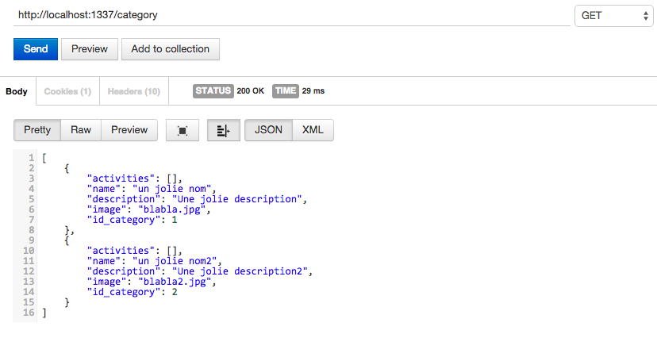
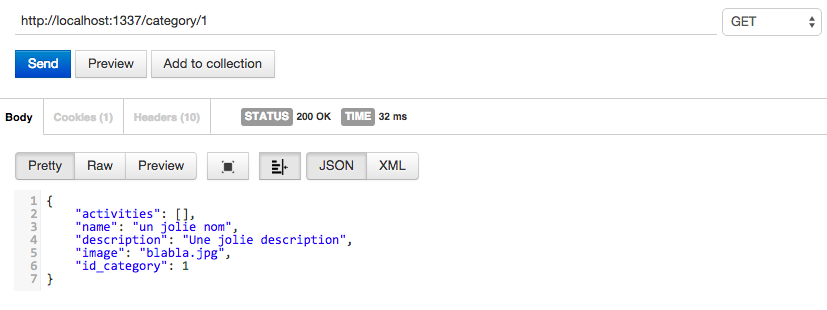
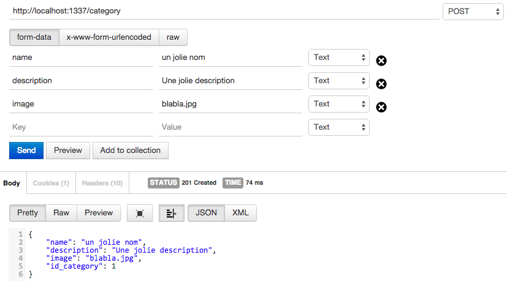
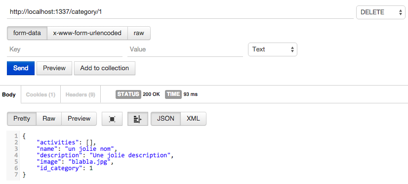

# ROUTES USE
##The methods Allowed
####GET
You can use Get Method on every Models, with or without parameters

**Except User Model**
####POST
You must is authentificated by the API
####PUT
You must is authentificated by the API
####DELETE
You must is authentificated by the API

## Example with Category
#### Get list of categories

#### Get one category by id

####  Add new category

#### Delete category by id

